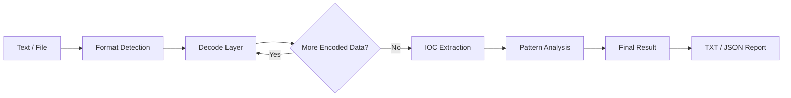
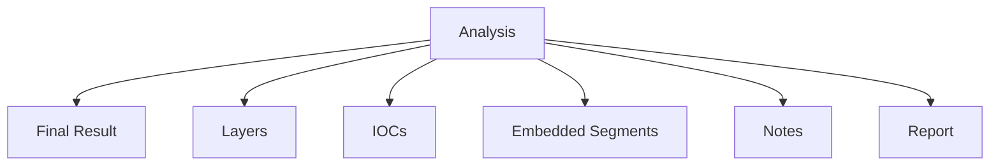
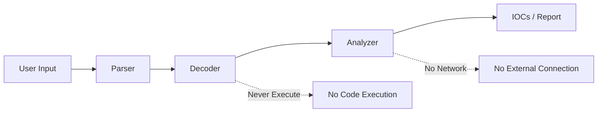
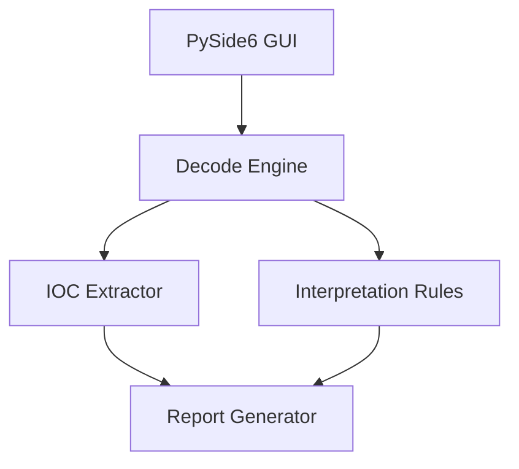

# CyberDecoder

### Offline Multi-Layer Decoder & IOC Analyzer

[](https://www.python.org/)
[](https://doc.qt.io/qtforpython/)
[]()
[]()
[]()
[](LICENSE)

CyberDecoder is a desktop utility for **decoding, inspecting, and triaging suspicious encoded content**.

It automatically identifies supported encoding formats, decodes content layer by layer, extracts embedded IOCs, and highlights patterns that may deserve further investigation.

Everything is processed locally. **No network connection is required and decoded content is never executed.**

---

## Features

| Capability                  | Description                                                                       |
| --------------------------- | --------------------------------------------------------------------------------- |
| Multi-layer decoding        | Automatically detects and decodes supported layers until reaching a stable result |
| Automatic detection         | Identifies likely encoding formats using validation and statistical checks        |
| Embedded decoding           | Finds encoded segments inside larger text, logs, and JSON values                  |
| IOC extraction              | Extracts URLs, domains, IPs, emails, paths, registry keys, and hashes             |
| Defanged IOC recovery       | Restores formats such as `hxxp` and `[.]` before extraction                       |
| PowerShell analysis         | Supports `-EncodedCommand` using UTF-16LE                                         |
| JWT inspection              | Detects and decodes JWT structures                                                |
| Compressed data             | Supports Gzip and Zlib                                                            |
| Suspicious pattern analysis | Highlights content that may require analyst review                                |
| Reports                     | Export decoded results as TXT or JSON                                             |
| Offline-first               | No cloud services, telemetry, or external lookups                                 |
| Safety controls             | Depth limits, loop detection, and compressed-output limits                        |

---

## Supported Formats

### Text / Encoding

* Base64
* Base64 URL-safe
* Base64 without padding
* Wrapped Base64
* Base32
* Hexadecimal
* `\x41` style hex
* `0x41` style hex
* Space-separated hex
* URL encoding
* Unicode escapes
* `%uXXXX`
* HTML entities

### Structured / Encapsulated Data

* JSON
* JWT
* Gzip
* Zlib
* PowerShell `-EncodedCommand` (UTF-16LE)

CyberDecoder can also detect supported encoded content **inside larger text**, rather than requiring the entire input to be encoded.

---

## Workflow



---

## Multi-Layer Decoding

CyberDecoder does not stop after the first successful decode.

For example:

```text
Base64
  ↓
URL Encoding
  ↓
Base64
  ↓
Gzip
  ↓
JSON
  ↓
IOC Extraction
```

The application records every detected layer so the analyst can see **how the final result was reached**.

---

## IOC Extraction

CyberDecoder searches decoded content for:

```text
URLs
Domains
IPv4 Addresses
Email Addresses
Windows Paths
UNC Paths
Registry Keys
MD5
SHA1
SHA256
```

Defanged indicators are normalized before extraction:

```text
hxxp://example[.]com
        ↓
http://example.com
```

The original content remains available for inspection.

---

## Analysis Interface

The interface is divided into focused views:



### Final Result

Displays the final decoded output in a readable format.

### Layers

Shows every decoding step, detected format, and confidence information.

### IOCs

Displays extracted indicators grouped by type.

### Embedded Segments

Shows encoded content discovered inside a larger input.

### Notes

Provides analyst-oriented observations generated from the decoded content.

### Report

Creates a structured TXT or JSON report.

---

## Security Model

CyberDecoder treats all input strictly as **data**.



### Safety Controls

* Maximum decode depth: **12 layers** by default
* Loop detection to stop repeated output
* Compressed output limit: **32 MB**
* No network communication
* No execution of decoded commands or files
* Input is processed locally
* Original source data is preserved

> CyberDecoder is a decoding and triage utility. It does not execute, detonate, or sandbox decoded content.

---

## Example

Input:

```text
JAB3AGcAPQ...
```

CyberDecoder may identify:

```text
PowerShell EncodedCommand
        ↓
UTF-16LE
        ↓
PowerShell Script
        ↓
IOC Extraction
        ↓
Suspicious Pattern Analysis
```

The analyst can inspect each stage instead of relying only on the final output.

---

## Detection & Interpretation

The interpretation layer does **not** attempt to prove that content is malicious.

Instead, it highlights patterns that may deserve investigation, such as:

* Encoded PowerShell
* Multiple decoding layers
* Embedded URLs
* Suspicious download-related strings
* Obfuscation indicators
* Network locations
* Script-related content

This keeps the tool focused on **triage and explainability** rather than making unsupported verdicts.

---

## Installation

### Windows

Run:

```text
run_windows.bat
```

The launcher installs the required Python dependency once and starts CyberDecoder.

### Linux / macOS

```bash
./run.sh
```

### Manual

```bash
pip install -r requirements.txt
python main.py
```

---

## Build Standalone EXE

### Windows

Run:

```text
build_windows.bat
```

Output:

```text
dist/CyberDecoder.exe
```

The generated executable is designed to run without requiring a separate Python installation.

### Linux / macOS

```bash
./build.sh
```

---

## Usage

1. Paste text into the application or drag a file into the window.
2. Press `Ctrl+Enter` to analyze.
3. Review the detected decoding chain.
4. Inspect the final result, layers, IOCs, embedded segments, and notes.
5. Export the analysis as TXT or JSON.

### Shortcuts

| Shortcut       | Action               |
| -------------- | -------------------- |
| `Ctrl+O`       | Open file            |
| `Ctrl+Shift+V` | Paste input          |
| `Ctrl+Enter`   | Analyze              |
| `Ctrl+C`       | Copy selected output |

An **automatic analysis** mode is also available.

---

## Project Architecture



Repository structure:

```text
CyberDecoder/
├── main.py
├── requirements.txt
├── run_windows.bat
├── run.sh
├── build_windows.bat
├── build.sh
│
├── cyberdecoder/
│   ├── engine.py
│   ├── ioc.py
│   ├── interpret.py
│   ├── report.py
│   ├── gui.py
│   └── theme.py
│
├── tools/
│   └── make_icon.py
│
├── samples/
│
└── tests/
```

---

## Testing

Tests can be executed with:

```bash
python -m unittest discover -s tests -t .
```

The test suite covers core decoding behavior, detection logic, IOC extraction, and other application components.

---

## Limitations

CyberDecoder is designed for **decoding and triage**, not cryptographic recovery.

It does not attempt to break real encryption such as:

```text
AES
RC4
XOR-based encryption
```

Additional limitations:

* Detection is validation/statistics based and can produce occasional false positives.
* Random text may rarely resemble a supported encoding.
* Files larger than **5 MB** are not loaded through the GUI.
* Deep or highly specialized malware-specific obfuscation may require manual analysis or dedicated tooling.

For uncertain detections, review the **Layers** tab and the original input.

---

## Privacy

CyberDecoder is designed to operate completely locally.

There are:

* No API keys
* No cloud processing
* No automatic uploads
* No telemetry
* No external IOC lookups
* No requirement for Internet access

---

## Roadmap

Potential future improvements:

* Additional encoding formats
* More structured file decoders
* Custom decoding rules
* YARA-based content inspection
* Richer IOC categorization
* HTML reporting
* Advanced analyst workflows

---

## License

This project is licensed under the **MIT License**.

See [LICENSE](LICENSE) for details.

---

## Disclaimer

CyberDecoder is intended for **authorized security analysis, malware research, incident response, and defensive investigation**.

Always analyze potentially dangerous samples in an isolated environment.
